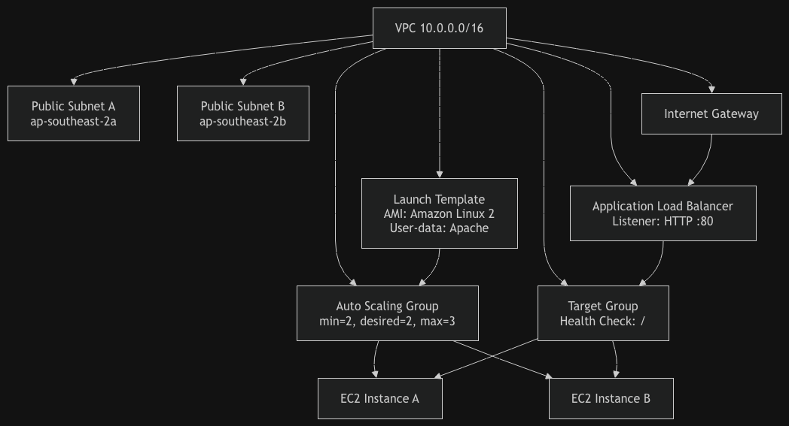

#Overview
This project implements an auto‑healing, N+1 web tier on AWS using Terraform v1.x.
The architecture ensures that the application can lose any single VM without downtime, with all infrastructure provisioned via Infrastructure as Code (IaC).

The solution uses:

1. AWS Application Load Balancer (ALB)

2. AWS Auto Scaling Group (ASG)

3. Launch Template (LT)

4. Amazon Linux 2 EC2 instances

5. Terraform modules for network, load balancer, and compute

6. The system is fully self‑healing, self‑provisioning, and horizontally scalable.

#Why AWS?
AWS was selected because:

It provides first‑class auto‑healing primitives (ASG + LT + ALB health checks)

Terraform has mature AWS provider support

ALB + Target Groups offer native health monitoring

EC2 user‑data allows simple provisioning of a static web page

AWS pricing allows the solution to remain under AUD 20/month

#Architecture Diagram
Components:

VPC (10.0.0.0/16)

Two public subnets (ap-southeast-2a, ap-southeast-2b)

Internet Gateway + route tables

Application Load Balancer

Target Group (HTTP health checks)

Auto Scaling Group (min=2, desired=2, max=3)

Launch Template (Apache static page)

EC2 instances (Amazon Linux 2)

#Traffic flow:

Client → ALB → Target Group → EC2 Instances (ASG)

#Key Features 
1. Auto‑Healing
Terminating any EC2 instance triggers the ASG to automatically launch a replacement.
Health checks ensure only healthy instances receive traffic.

2. Self‑Provisioning (IaC Only)
terraform apply → builds the entire stack

Second terraform apply → no changes (idempotent)

3. N+1 Capacity
ASG configuration:

Code
min_size         = 2
desired_capacity = 2
max_size         = 3
This ensures two instances are always running behind the ALB.

4. Static Web Page
User‑data installs Apache and serves:

Code
Hello from your auto-healing web tier!
5. Terraform Modules
The project is structured into:

#Code
modules/
  network/
  load_balancer/
  compute/
main.tf
variables.tf
outputs.tf
Each module is isolated, reusable, and clearly parameterised.

#Repository Structure
Code
auto-healing-web-tier/
│
├── main.tf
├── variables.tf
├── outputs.tf
├── README.md
│
└── modules/
    ├── network/
    │   ├── main.tf
    │   ├── variables.tf
    │   └── outputs.tf
    │
    ├── load_balancer/
    │   ├── main.tf
    │   ├── variables.tf
    │   └── outputs.tf
    │
    └── compute/
        ├── main.tf
        ├── variables.tf
        └── outputs.tf
#How to Deploy
Prerequisites
Terraform v1.x

AWS CLI configured (aws configure)

IAM user with EC2, VPC, and ELB permissions

#Steps to Run
1. Initialise Terraform
Code
terraform init
2. Preview the plan
Code
terraform plan
3. Apply the infrastructure
Code
terraform apply
4. Validate N+1
Go to:

EC2 → Auto Scaling Groups → Instances

You should see 2 running instances

5. Validate auto‑healing
Terminate one instance:

EC2 → Instances → Select → Instance state → Terminate

ASG will automatically launch a replacement.

6. Test the ALB
Visit the output DNS:

#Code
http://<alb_dns_name>

#Assumptions
1. Public subnets are acceptable for this exercise

2. Apache is sufficient for static content

3. No database or backend required

4. No private networking required

5. No CI/CD pipeline required (optional)

Estimated Monthly Cost (AUD)
Component	Qty	Cost (AUD)
EC2 t2.micro	2	~AUD 13.00
ALB	1	~AUD 6.00
Data transfer	minimal	~AUD 0.50
Total		~AUD 19.50/month

#Optional Bonus (Not Implemented)
Containerised version could include:

Dockerfile

Push to Docker Hub

User‑data to pull and run container

#Validation
All must‑have requirements have been met:

1. Auto‑healing 

2. Self‑provisioning 

3. N+1 capacity 

4. Static page 

5. Terraform modules 
