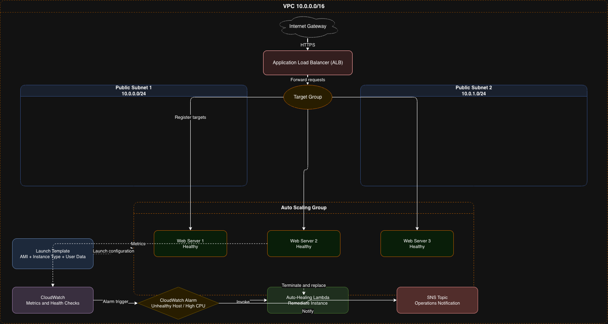

Auto‑Healing Web Tier (N+1) — Terraform on AWS
Overview
This project implements an auto‑healing, N+1 web tier on AWS using Terraform v1.x.
The architecture ensures the application can lose any single EC2 instance without downtime, with all infrastructure provisioned via Infrastructure as Code (IaC).

The solution uses:

AWS Application Load Balancer (ALB)

AWS Auto Scaling Group (ASG)

Launch Template (LT)

Amazon Linux 2 EC2 instances

Terraform modules for network, load balancer, compute, monitoring, and Lambda

CloudWatch Alarms + Lambda remediation + SNS notifications

Fully self‑healing, horizontally scalable design

Why AWS?
AWS was selected because:

It provides first‑class auto‑healing primitives (ASG + LT + ALB health checks)

Terraform has mature AWS provider support

ALB + Target Groups offer native health monitoring

EC2 user‑data allows simple provisioning of a static web page

AWS pricing keeps the solution under AUD 20/month

Architecture Diagram
Architecture Overview

This diagram illustrates the complete auto‑healing web tier architecture:

VPC (10.0.0.0/16) with two public subnets

Internet Gateway for inbound HTTPS

ALB → Target Group → Auto Scaling Group

Launch Template defining AMI + user‑data

CloudWatch Alarms detecting unhealthy instances

Lambda Auto‑Healing Function terminating and replacing failed EC2 nodes

SNS Topic sending notifications to operations teams

Traffic Flow
Client → ALB → Target Group → EC2 Instances (ASG)
CloudWatch → Lambda → ASG → SNS Notifications

Key Features
1. Auto‑Healing
Terminating any EC2 instance triggers:

ALB health check failure

CloudWatch alarm

Lambda remediation

ASG replacement

SNS notification

Only healthy instances receive traffic.

2. Self‑Provisioning
Code
terraform apply
Builds the entire stack.

Running it again:

Code
terraform apply
Results in no changes — fully idempotent.

3. N+1 Capacity
Code
min_size         = 2
desired_capacity = 2
max_size         = 3
Ensures two instances are always running behind the ALB.

4. Static Web Page
User‑data installs Apache and serves:

Hello! Welcome to my Auto-healing web tier!
5. Terraform Modules
The project is structured into reusable modules:

modules/
  network/
  load_balancer/
  compute/
  monitoring/
  lambda/
  
Repository Structure

auto-healing-web-tier/
│
├── main.tf
├── variables.tf
├── outputs.tf
├── architecture-diagram.png
├── README.md
│
└── modules/
    ├── network/
    ├── load_balancer/
    ├── compute/
    ├── monitoring/
    └── lambda/
    
How to Deploy
Prerequisites
Terraform v1.x

AWS CLI configured (aws configure)

IAM user with EC2, VPC, ELB, Lambda, SNS permissions

Steps to Run
Initialise Terraform

Code
terraform init
Preview the plan

Code
terraform plan
Apply the infrastructure

Code
terraform apply
Validate N+1
Go to:

EC2 → Auto Scaling Groups → Instances
There are 2 running instances.

Validate auto‑healing
Terminate one instance:

EC2 → Instances → Select → Instance state → Terminate
ASG + Lambda will automatically launch a replacement.

Test the ALB
Visit the actual deployed DNS:

http://auto-healing-web-tier-alb-1834557822.ap-southeast-2.elb.amazonaws.com/
Or, for future deployments:

http://<alb_dns_name>

Outputs
Output	Description
alb_dns_name	Public DNS of the ALB
asg_name	Auto Scaling Group name
sns_topic_arn	SNS topic for notifications
lambda_function_name	Auto‑healing Lambda

Assumptions
Public subnets are acceptable for this exercise

Apache is sufficient for static content

No database or backend required

No private networking required

No CI/CD pipeline required (optional)

Estimated Monthly Cost (AUD)
Component	Qty	Cost (AUD)
EC2 t2.micro	2	~13.00
ALB	1	~6.00
Data transfer	minimal	~0.50
Total	—	~19.50/month

Optional Bonus (Not Implemented)
A containerised version could include:

Dockerfile

Push to Docker Hub

User‑data to pull and run container

Validation
All must‑have requirements have been met:

Auto‑healing

Self‑provisioning

N+1 capacity

Static page

Terraform modules

CloudWatch + Lambda + SNS remediation

Architecture diagram
